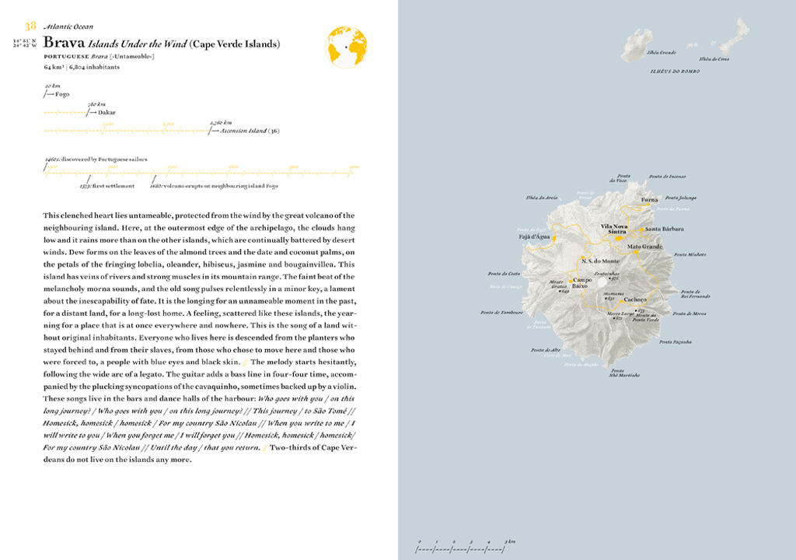

# Atlas of Remote Islands: A React Lab

This lab is based on the book _[Atlas of Remote Islands: Fifty Islands I Have Never Set Foot On and Never Will](https://www.amazon.com/Atlas-Remote-Islands-Fifty-Never/dp/014311820X)_ by Judith Schalansky. The book describes 50 remote islands from around the world; data about those islands has been collected into the `src/atlas-of-remote-islands.js` file. Your goal is to represent the islands as options on a travel-like site.

## Getting Started in CS50

1. Clone this repository using `git clone`
2. `cd` into the `react-prop-drilling` folder
3. `npm install`
4. `npm start`
5. If the app compiles with no errors:
    1. click on the `localhost` link, or
    2. tap the `CS50 IDE` link in the header and choose `Web Server`
6. If the app compiles with errors, to view the live app:
    1. tap the `CS50 IDE` link in the header
    2. choose `Web Server`
7. If the app fails to compile, re-clone the repository

## The Lab

1. Note that `App.js` is importing the `data` from `atlas-of-remote-islands.js`, and there is a `console.log(data)` as part of `App.js`. Open the Developer Tools in your browser and explore the `data` object.

2. One card has already been componentized for you. Use `.map()` to update `App.js` so that it generates a card for each entry in `data.islands`.

> It's ok if the cards don't get have any data in them, but there should be a total of 50 cards.

3. Update your `.map()` function to pass data about each island to each card as props. You can `console.log(props)` in `Card.js` to check that props are being passed.

4. From `Card.js`, pass props to the `<CardInfo />` component for the island name, description, latitude, longitude, and wikipedia link.

5. Display the island name, description, latitude, and longitude in the card. Then pass the Wikipedia link as a prop to the `<WikiButton />` component, and set the `href` for the `<a>` tag around the button. Clicking on each button should open that island's Wikipedia page in a new tab.

6. Pass the `image` URL to `<CardImage />` component, and check that CardImage.js is receiving it.

7. Use inline styling to set the `backgroundImage` of the `
` with `className=card-image` as the `image` passed to `<CardImage />` via props.

8. Add a new component to each card that renders a Google Map of each island.

> Hint: you can use the latitude and longitude along with Google Maps' `<embed>` code; also, set the width of the embed to `100%` to fill the container.

9. Update the interface to group cards by their `region`: Arctic Ocean, Atlantic Ocean, Indian Ocean, Pacific Ocean, Antarctic Ocean. How might you pre-process the `data` in order to get a list of all unique regions?

> Hint: consider how you might use the `.filter()` method to populate cards in each section.
